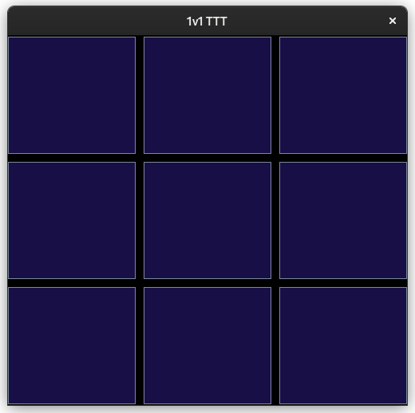
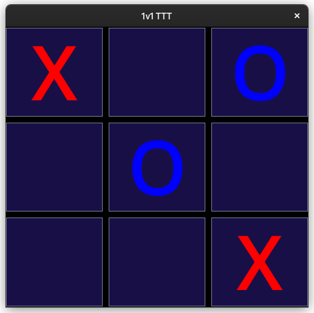
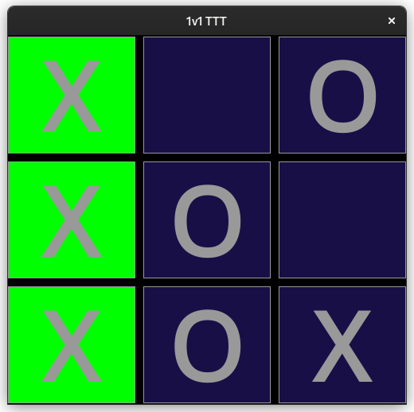

# mini_games - small games to help me gain experience
I wanted to do two things: build friendships, and gain coding experience. I thought I could do both by creating tiny games which I would play with people.

## Game 1: Tic-Tac-Toe
The first game I made (and the only one I've made so far) is the classic three by three tic tac toe. This is what the game looks like:

>New board:

>During game:

>Win condition:

## Game 2: Connect four
    TODO
## Game 3: Snake
    TODO
## Game 4: Pong
    TODO